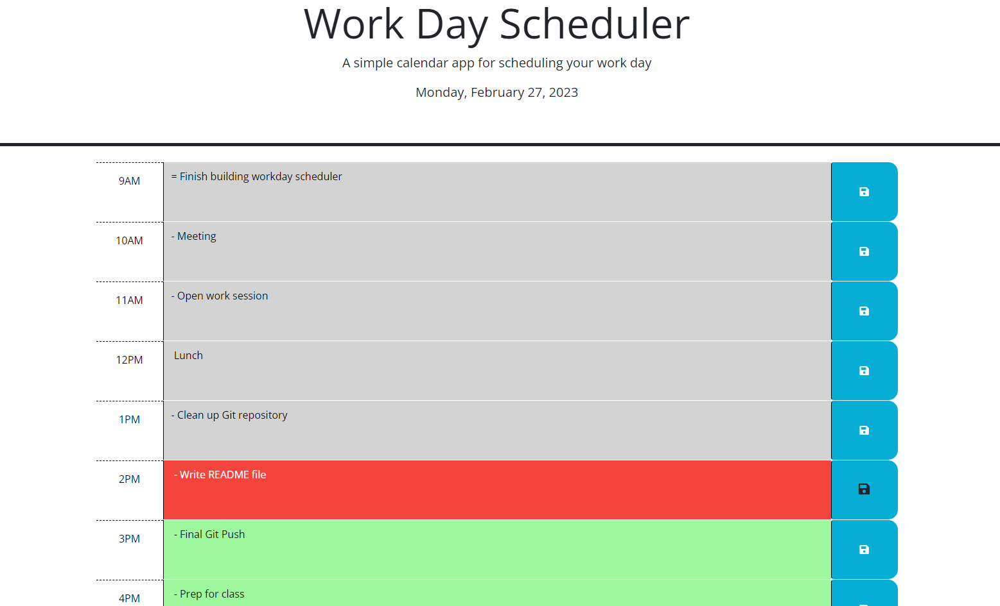

# Workday Scheduler

## Description

This simple, browser-based Workday Scheduler allows the user to track To-Do items for their workday.
Using Day.js functionality and formatting, the workday hours are color-coded based on whether they are past, present or future relative to the current time.
Upon saving notes within a given hour/row, the notes are stored in browser localStorage and written back to the page in the appropriate row when the page is reloaded from the same computer.

This project challenged me greatly to use and expand my proficiencies with JavaScript functions, event listeners, methods, DOM traversal syntax, and Day.js and browser localStorage functionality.

## Installation

To load and utilize this Workday Scheduler, simply visit the following URL from any contemporary web browser connected to the internet, and follow the prompts:

## Usage

Upon visiting the landing page at the above URL, the user is presented with a single-page Workday Scheduler showing rows for each hour in a standard 8-hour workday:
The current day and date are displayed in the page header.

Each row in the body of the page represents the workday hour specified in the row heading, and contains both an input text area where the user can enter to-do items for that hour, and a corresponding "Save" button at right which, when clicked, saves the to-do's for that hour into browswer localStorage so that the information persists when the page is refreshed.

The rows are also color-coded based on the current time relative to each hour represented by a row on the page:
Rows shaded grey are in the past, the row in red is the current hour, and rows shaded green are in the future.

## Appearance

## Credits

To learn and implement the javascript and Day.js functionality in this webpage, I referenced the following websites and tutorials:

MDN JavaScript Reference page:
https://developer.mozilla.org/en-US/docs/Web/JavaScript

W3 Schools Javascript and HTML DOM Reference:
https://www.w3schools.com/jsref/default.asp

Javascript.info LocalStorage reference:
https://javascript.info/localstorage

Day.js Documentation:
https://day.js.org/en/

## License

MIT License

Copyright (c) 2023 Peej D

Permission is hereby granted, free of charge, to any person obtaining a copy
of this software and associated documentation files (the "Software"), to deal
in the Software without restriction, including without limitation the rights
to use, copy, modify, merge, publish, distribute, sublicense, and/or sell
copies of the Software, and to permit persons to whom the Software is
furnished to do so, subject to the following conditions:

The above copyright notice and this permission notice shall be included in all
copies or substantial portions of the Software.

THE SOFTWARE IS PROVIDED "AS IS", WITHOUT WARRANTY OF ANY KIND, EXPRESS OR
IMPLIED, INCLUDING BUT NOT LIMITED TO THE WARRANTIES OF MERCHANTABILITY,
FITNESS FOR A PARTICULAR PURPOSE AND NONINFRINGEMENT. IN NO EVENT SHALL THE
AUTHORS OR COPYRIGHT HOLDERS BE LIABLE FOR ANY CLAIM, DAMAGES OR OTHER
LIABILITY, WHETHER IN AN ACTION OF CONTRACT, TORT OR OTHERWISE, ARISING FROM,
OUT OF OR IN CONNECTION WITH THE SOFTWARE OR THE USE OR OTHER DEALINGS IN THE
SOFTWARE.
